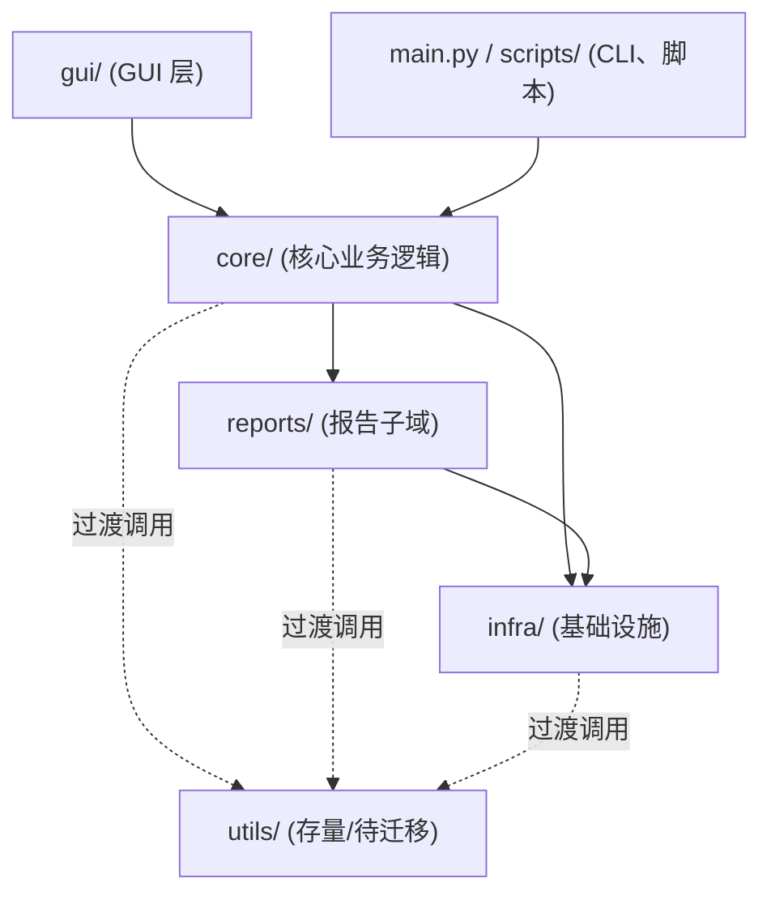

## 项目架构与分层说明

本项目是车载端侧应用自动化测试工具，核心由 **GUI 图形界面 + 稳定性/压力测试引擎 + 报告系统** 组成。
为提高可维护性与可扩展性，代码按以下层次进行组织和约定。

### 1. 顶层目录结构

- `gui/`：GUI 层
  - 负责窗口、控件、事件绑定与用户交互
  - 未来会从 `gui_main.py` 中逐步拆分到多个模块（主窗口、稳定性测试页、报告查看器等）
  - 不直接调用 ADB/pytest 等底层细节，应通过 `core`/`infra` 提供的接口

- `core/`：核心业务逻辑层（应用服务 + 领域模型）
  - 描述测试计划（test plan）、测试结果（test result）、设备与网络场景等领域模型
  - 提供“用例级别”的服务接口，例如：
    - **core/services/stability_service.py**：启动完整稳定性测试套件
    - 运行广播模式压力测试 / TTS 压力测试（仍由 `utils/stability_test` 执行）
    - **core/services/report_service.py**：报告重构（`regenerate_report`）、报告生成器工厂
  - 对下统一依赖 `infra`，对上被 GUI / CLI / pytest 调用

- `infra/`：基础设施层
  - 封装与外部世界交互的底层能力：
    - **infra/adb.py**：ADB 命令封装（`run`, `run_shell`, `list_devices`）
    - **infra/device_cleanup.py**：设备异常目录清理（`/data/anr`, `/data/tombstones`）
    - **infra/config.py**：配置读写与合并（`load_project_config`, `load_test_ui_config`）
    - **infra/logging.py**：日志记录与格式约定
    - **infra/mock_server.py**、**infra/network_proxy.py**：Mock Server / 网络代理
  - 只提供稳定 API，不做业务决策，可在不同场景下复用

- `reports/`：报告子域
  - 负责测试结果到报告的适配层：
    - 报告数据模型（如 `ReportData`、`PerformanceSummary`）
    - 报告生成与重构服务（目前仍基于 `utils/report_generator.py` 等）
    - 与 GUI 报告查看器的桥接适配
  - 后续会逐步把现有 `utils/report_*` 能力迁移并整理到本目录

- `utils/`（存量代码，渐进迁移）
  - 目前包含设备封装、Monkey 扩展、网络代理、Mock Server、性能采样、稳定性测试编排等大量逻辑
  - 重构方向：
    - 与 ADB / 系统交互强相关的模块 → 迁移/收口到 `infra/`
    - 与“测试计划/结果”相关的模块 → 迁移/收口到 `core/`
    - 报告相关模块 → 迁移/收口到 `reports/`

- 其他目录（保持现状）：
  - `conf/`：项目与 GUI 配置（`project.json`、`test_ui_config.json` 等）
  - `baselines/`：性能与稳定性基线数据
  - `logs/`：运行日志目录（包含按设备/时间划分的子目录）
  - `apks/`：APK 存放目录
  - `tests/`：pytest 用例（含稳定性/性能/异常恢复测试）
  - `scripts/`：命令行辅助脚本（如 `build_exe.py`、清理脚本等）

### 2. 分层依赖关系

整体依赖方向遵循“自上而下”：

约束与约定（简要版）：

- `gui/` **禁止** 直接依赖 `utils/`，必须经由 `core/` 或 `infra/` 提供的接口
- `core/` 只能向下依赖 `infra/` 和 `reports/`，不直接操作 GUI 控件
- `infra/` 聚焦“如何做”（与系统/网络交互），不关心“为什么做”（业务决策）
- `reports/` 聚焦“如何展示和组织结果”，不发起测试

### 3. 渐进式迁移策略

为避免一次性大改导致不稳定，代码迁移遵循以下策略：

1. **先建分层目录与包**（本文件所述结构），保持现有入口和行为不变；
2. **优先拆分 `gui_main.py`**：
   - 把纯 UI 构建和布局代码迁移到 `gui/` 子模块
   - 为 GUI 事件回调增加 `core.services` 层的调用封装
3. **逐步从 `utils/` 迁移能力**：
   - 设备/ADB/网络相关 → `infra/`
   - 稳定性与压力测试编排 → `core/`
   - 报告生成/重构 → `reports/`
4. **在迁移过程中保持接口向下兼容**：
   - 对外暴露的主要入口（如 `main.py`、`gui_main.py`）保持调用方式不变
   - 内部通过适配层将旧实现逐步替换为新分层实现

随着后续重构推进，本文件会根据实际落地情况继续细化（例如增加各子模块说明和示例调用方式）。

